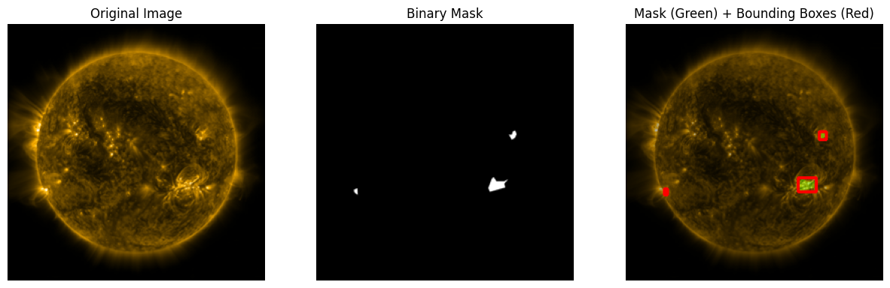
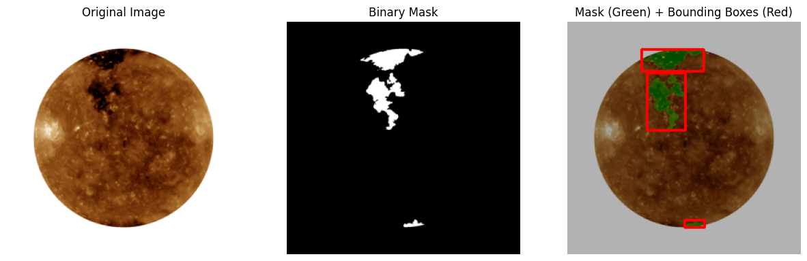

# Solar Structure Detection in SDO/AIA Observations

## Overview

This repository contains the supporting code for the manuscript:

**Gonidakis, P. et al.**  
*Comparing Solar Structure Detection Methods in SDO/AIA Observations and Their Application to Raw, Uncalibrated Data*  
Submitted to **JGR: Machine Learning and Computation**

The code accompanies the experiments and analyses presented in the paper and focuses on the detection of solar structures in **SDO/AIA EUV observations**, using both calibrated (Level-2) and raw, uncalibrated (Level-0) data.

---

## Repository Contents

This repository includes:

1. **YOLOv8n models** for:
   - Active Region (AR) detection  
   - Coronal Hole (CH) detection  

2. **BCVO framework**  
   A Python implementation of the *Basic Computer Vision Operations* (BCVO) approach used as a classical baseline for solar structure detection.

3. **Pre-processing pipeline for SDO/AIA Level-0 data**  
   Scripts and utilities required to prepare raw, uncalibrated SDO/AIA observations for inference with:
   - SCSS-Net  
   - YOLOv8n  
   - BCVO  

   (as described in the manuscript)

---

## External Dependencies

The **SCSS-Net** framework is developed and maintained externally and is publicly available at:

🔗 https://github.com/space-lab-sk/scss-net

---

## Notes

- This repository is intended to support **reproducibility** of the results presented in the paper.
- Hardware benchmarking (e.g., FPGA deployment) is **not** included and is discussed as future work in the manuscript.

---


## Indicative Examples

The following examples illustrate the impact of the proposed pre-processing pipeline and the resulting solar structure detections on SDO/AIA data.

<p align="center">
  
</p>
<p align="center">
  <em>
    <strong>Figure 1.</strong> Raw Level-0 SDO/AIA observation with minimal pre-processing. 
    Instrumental artefacts and intensity inhomogeneities significantly degrade image quality.
  </em>
</p>

<p align="center">
  
</p>
<p align="center">
  <em>
    <strong>Figure 2.</strong> The same Level-0 SDO/AIA image after applying the proposed pre-processing pipeline. 
    The correction of instrumental artefacts and intensity normalization substantially improves 
    visual quality and robustness for subsequent machine-learning and computer-vision methods.
  </em>
</p>

<p align="center">
  
</p>
<p align="center">
  <em>
    <strong>Figure 3.</strong> Active Region (AR) detection results obtained using the YOLOv8n framework. 
    Predicted bounding boxes are overlaid on the pre-processed SDO/AIA image.
  </em>
</p>

<p align="center">
  
</p>
<p align="center">
  <em>
    <strong>Figure 4.</strong> Coronal Hole (CH) detection and segmentation results. 
   </em>
</p>

---

## Citation

If you use this code in your work, please cite the associated paper:

```bibtex
@unpublished{gonidakis2025solar,
  title   = {Comparing Solar Structure Detection Methods in SDO/AIA Observations and Their Application to Raw, Uncalibrated Data},
  author  = {Gonidakis, Panagiotis and others},
  journal = {Journal of Geophysical Research: Machine Learning and Computation},
  year    = {2025},
  note    = {submitted}
}


---


